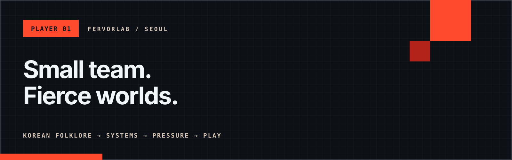

  

 

<code>TAILBOUND // NOW FORGING</code>

## Enter the folklore loop.

A native action roguelite rooted in Korean folklore, built for decisive combat
and repeatable runs.

  <code>KOREAN FOLKLORE</code>
  <code>GODOT 4</code>
  <code>NATIVE MOBILE</code>

[**Explore Tailbound ↗**](https://tailbound.xyz/)

---

### How we build

- **Source: folklore.** Cultural texture becomes systems, tension, and play.
- **Runtime: native.** Responsive interactions with focused native performance.
- **Party: small.** Disciplined scope, strong authorship, deliberate detail.

  <a href="https://fervorlab.com/">Studio</a>
  &nbsp;·&nbsp;
  <a href="https://tailbound.xyz/">Tailbound</a>
  &nbsp;·&nbsp;
  <a href="mailto:contact@fervorlab.com">Contact</a>

